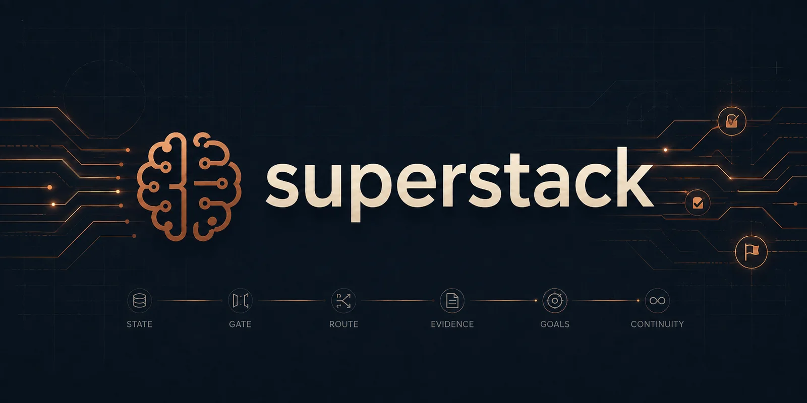
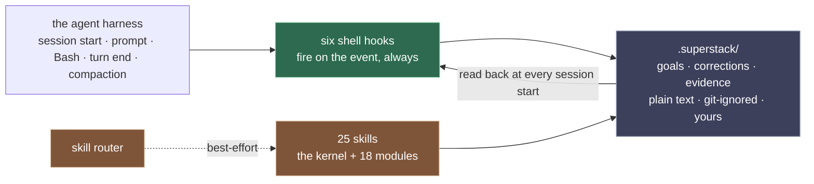
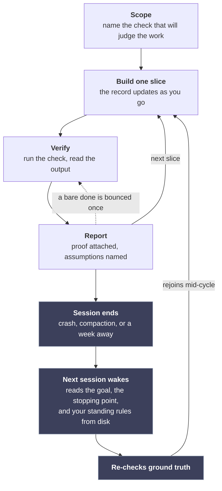

<div align="center">



<h3>A full engineering bench for your coding agent.<br>The work survives any session, without any handoffs, and every done comes with proof.</h3>

<p>
  
  
  
  
</p>

<p>
  <a href="#install"><b>Install</b></a> ·
  <a href="#the-deterministic-spine"><b>The spine</b></a> ·
  <a href="#the-specialist-bench"><b>The bench</b></a> ·
  <a href="#the-state-your-workspace-grows"><b>Your state</b></a> ·
  <a href="./CHANGELOG.md"><b>Changelog</b></a>
</p>

</div>

`superstack` is a Claude Code plugin you drive all day: a bench of 25 specialist skills covering every stage of engineering work, plus the part no skill can do alone, where your goals, corrections, and evidence live in plain files that every session reads back, with gates that bounce any "done" carrying no proof. Claude Code's `/goal` checks a goal you type in one session; superstack is where goals live across all of them.

If you run long work through a coding agent, you have met the problems it works on:

- You explain the project *again*. Session nine starts as ignorant of the goal as session one did, and the work drifts before anyone notices.
- A compaction lands mid-feature and takes the reasoning with it; the session that continues doesn't know what it lost.
- The load-bearing discussion (why an approach was rejected, what you both agreed the thing is *for*) lives only in the conversation. It never lands in a file, and when the session ends it is gone for good.
- You wrote a HANDOFF.md at the end of the last session. It was stale by the time it was read, and the next session believed it anyway.
- The rules you've already laid down ("never touch that table", "always run the linter first") dissolve at the next compaction or cold start, so you correct the model on Tuesday and repeat yourself on Thursday.
- You end up installing a separate memory plugin just to save and recall project context: bolted-on commands for what should simply live with the project, on disk.
- You'd like to hand over a whole build to run end to end, but nothing records which of your approval gates it skipped while you were away.
- "Done" arrives confidently with nothing behind it. The tests it cites were never actually run.

And a long tail of the same problem at every other stage of delivery: shaping a raw idea, scoping, debugging, reviewing, verifying, shipping, a live incident, a risky upgrade, the report afterwards. Each of those moments has [a specialist on the bench](#the-specialist-bench): `superstack-inception` turns a raw idea into something buildable, the kernel's `scope · debug · review · verify · ship` runners own the everyday build loop, `superstack-execute` carries a build across many sessions, `superstack-incident` drops everything to mitigate when production is down, `superstack-doctrine` turns your corrections into standing rules. And when your field needs specialists the roster doesn't ship (a data analyst's pack, an infrastructure pack, a frontend reviewer's pack), `superstack-smith` is the admission gate for building your own.

What superstack does about them: the goal and the stopping point ride in files on disk, written while the work happens, so a session that starts cold or survives a compaction reads where things stand instead of trusting a handoff summary. Corrections become standing rules, read back until you lift them, and a one-hour bug fix gets the same treatment as a campaign. Plans stay light on purpose: the goal, each milestone's done-when, and your rulings, and the rest is left to a model that builds better adapting on the fly than following a step list written on day one; for serious work, a costlier build that lands right the first time beats a week of patched iterations.

## Install

```text
/plugin marketplace add debabsah/superstack
/plugin install superstack@superstack
/reload-plugins
```

**How you know it's working:** your next session in any project opens with one `superstack:` line (a fresh workspace gets a one-time overlay offer). Type an idea-shaped prompt like "create a mario game in a single html document" in an empty folder and the front door offers to shape it first. `/superstack:superstack-status` reports the workspace record any time.

**Requirements:** Claude Code with plugin support; Bash, git, `jq`, the `claude` CLI on PATH (the self-check suites call its validator), and standard POSIX tools; a capable model at medium-or-higher effort. Hooks are shell scripts, tested on macOS, Linux, and Windows (under Git Bash) in CI on every push; on native Windows install Git Bash and `jq` first, and WSL behaves like Linux.

> [!IMPORTANT]
> `jq` is load-bearing: without it, the publish gate and the prompt-time door fail open, silently disabled while everything else keeps working. Install it to keep the whole safety layer armed.

<details>
<summary>From a local clone (also how you run the test suites)</summary>

```text
git clone https://github.com/debabsah/superstack
/plugin marketplace add /path/to/superstack
/plugin install superstack@superstack
/reload-plugins
```

Self-checks, from the clone's root: `for f in hooks/test-*.sh; do bash "$f" || exit 1; done`

</details>

<details>
<summary>Already running godmode or fable-method?</summary>

- godmode coexists by design: superstack owns durable project truth (oracle, gotchas, statutes, the calibration record), godmode owns trial/plan state, and each points to the other at session start.
- fable-method should be disabled while superstack is on: superstack ships the same calibration kernel, and running both double-fires the gates. An existing `.fable/` state carries over with `mv .fable .superstack`.

</details>

## The deterministic spine

Method plugins usually answer these pains with skill text: good advice the model follows when the right skill loads at the right moment. But loading is best-effort. The model has to notice that a skill applies before any of its advice loads, and nothing guarantees it notices at the moment that matters. superstack splits the job: everything that must not depend on being noticed is a shell hook that fires on the harness event regardless, and the record those hooks enforce lives in files on disk, not in anyone's memory of the conversation.

Six shell hooks run no matter what the model loads or forgets:

- **A prompt-time door.** A raw idea in an unshaped workspace gets one offered question: shape it first, or build straight away. Honored either way, silently.
- **The claims gate.** A turn that changed things cannot end on a bare "done"; bounced once until the claim carries its `Verified:` / `Assumed:` / `PROVISIONAL` ledger.
- **The look gate.** Change a file with a face (`.html`, `.tsx`, `.css`, and so on), claim done on logic-only evidence, and it asks once whether anybody actually looked.
- **The publish gate.** `git push`, `gh pr create`/`merge`, releases, `npm publish`, `docker push`, and `terraform`/`kubectl apply` are held until a fresh sweep receipt exists. The sweep checks the outgoing delta for secrets (fail-closed), AI-authorship traces, confidential terms, and stale public claims; receipts expire after an hour.
- **The session-start voice.** The goal, standing law, open questions, and parked work under a single line budget. The goal composes first and survives longest; when the budget forces a drop, the drop is announced, never silent.
- **The compaction carrier.** The plan's goal and frontier survive compaction, sanitized on the way through.

Every gate bounces once, logs, and lets an identical retry through. That is deliberate: a gate that can trap a session is a worse failure than one you can override, so the override is always available and always lands in the log where you can see it. The gates put calibration pressure on the model's claims; they are not access control, and `SUPERSTACK_GATES=off` silences all of them.



What it costs: the hooks are local shell, no model calls, milliseconds per event. The skill listing adds roughly 2,000 tokens to the session context, and the session-start voice adds at most 8 lines.

## The specialist bench

None of these fire on their own; only the spine above is guaranteed to fire. Type what you want in a plain sentence and Claude routes to a specialist from its description, best-effort; it is normal for several to work one task in sequence.

The calibration kernel (the `superstack` method skill with its `scope · debug · review · verify · ship · status` runners) owns building and claiming: work scoped against a named check, verified at the layer of the claim, and risk-tiered. Adversarial review at the higher tiers runs through a dispatched reviewer agent that cannot edit what it reviews; its tool allowlist has no write access, enforced by the harness rather than by asking.

On a real task the bench runs as a loop, and the loop survives the session ending:



The lower path is the difference: instead of starting over or trusting a handoff summary, the next session rejoins the same loop mid-cycle from the record on disk.

Eighteen lifecycle modules around it, by the moment they serve:

**Starting something**

- `superstack-inception`: shapes a raw idea before building starts; when you would rather react to options than answer questions, it hands the middle to cocreate and finishes after
- `superstack-cocreate`: probe rounds when you can't state requirements yet; on its own it shapes a doc, spec, or schema inside an existing project, no new idea required
- `superstack-spike`: time-boxed feasibility probes, harvested then discarded
- `superstack-decide`: technical forks recorded as decision records

**Keeping long work on course**

- `superstack-execute`: milestone campaigns with crash-safe bookkeeping; progress is stamped after each step, so a dead session is detected by its missing stamp, and audits close milestones cold
- `superstack-continuity`: safe resume, with ground truth re-verified and inherited state distrusted
- `superstack-doctrine`: corrections kept verbatim, scoped, and binding until you lift them
- `superstack-queue`: parked ideas with revisit triggers
- `superstack-autonomy`: unattended work leaves a ledger of every human gate it skipped, surfaced each session until you close it

**Production, data, and dependencies**

- `superstack-incident`: mitigate-first response when production is down
- `superstack-migrate`: expand-migrate-contract data changes, tested rollbacks
- `superstack-deps`: risk-batched upgrades, changelogs actually read

**Claiming done and going public**

- `superstack-experiential`: anything with a face gets looked at before "done"
- `superstack-outward`: the go-public sweep behind the publish gate
- `superstack-smith`: the admission gate for new skills

**Reports, predictions, and walkthroughs**

- `superstack-digest`: period reports assembled from logs, never memory
- `superstack-value`: outcome claims recorded as falsifiable predictions
- `superstack-teach`: walkthroughs that grow your mental model

> [!TIP]
> Slash commands force a specific door; `/superstack:superstack` is the front door if you ever feel lost.

## The state your workspace grows

The paper trail builds up as a side effect of the work; nobody has to remember to ask for it. Decision records with the why, an evidence ledger behind every done-claim, predictions settled true or false:

```text
.superstack/                   git-ignored; rides the checkout, never your commits
├── project.md                 the overlay: your acceptance oracle, conventions, gotchas
├── tasks/  plans/             in-flight work and campaigns, each carrying its goal line
├── doctrine.md                your corrections, verbatim, with scope and supersession
├── claims-log  gate-log  residuals.md   the calibration record behind done-claims
├── queue.md  value-log  toured.md       parked ideas, predictions, walkthrough history
└── receipts/  outward-pass    check outputs with commands and repo revisions; sweep receipts
```

One deliberate exception: `superstack-decide` offers (never silently creates) a committed `docs/decisions/` directory, because decision records must survive machines and teammates.

**Local and inspectable.** The hooks are plain shell on your machine and call no network service; read them in [`hooks/`](hooks/), where the test suites live beside them. Installing and uninstalling touches nothing of yours except one `.superstack/` ignore rule. The routing eval, with its method and recorded run, is in [`eval/routing/`](eval/routing/) if you want to check the claims.

**Uninstall:** `/plugin uninstall superstack@superstack`. Your `.superstack/` directories and the ignore rule stay where they are; they're your files.

> [!NOTE]
> Everything under `.superstack/` is plain text that gets read into the model's context. Treat it with the trust you'd give your shell profile, and leave it git-ignored; the session-start voice warns if it ever ends up tracked.

---

<div align="center">
<sub>MIT © <a href="./LICENSE"><code>debabsah</code></a></sub>
</div>
