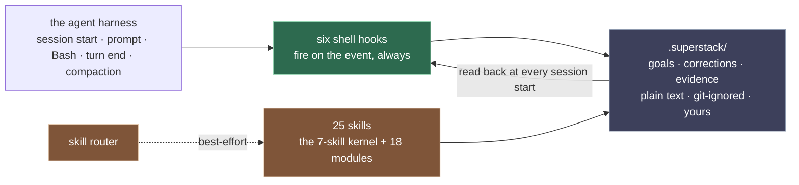
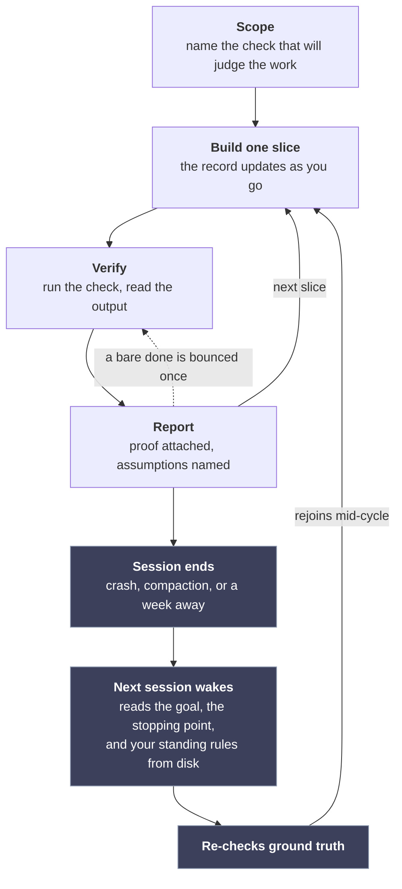

<div align="center">


<h3>A full engineering bench for your coding agent.<br>The work survives any session, without any handoffs, and every done comes with proof.</h3>

<p>
  
  
  
  
</p>

<p>
  <a href="#install"><b>Install</b></a> ·
  <a href="#the-deterministic-spine"><b>The spine</b></a> ·
  <a href="#the-specialist-bench"><b>The bench</b></a> ·
  <a href="#the-state-your-workspace-grows"><b>Your state</b></a> ·
  <a href="./CHANGELOG.md"><b>Changelog</b></a>
</p>

</div>

`superstack` is a Claude Code plugin you drive all day: a bench of 25 specialist skills covering every stage of engineering work, plus an always-on layer of shell hooks that runs whether or not any skill loads. That layer keeps your goals, corrections, and evidence in plain files every session reads back, and its gates bounce any "done" that carries no proof. Claude Code's `/goal` checks a goal you type in one session; superstack is where goals live across all of them.

If you run long work through a coding agent, you have met the problems it works on:

- You explain the project *again*. Session nine starts as ignorant of the goal as session one did, and the work drifts before anyone notices.
- A compaction lands mid-feature and takes the reasoning with it; the session that continues doesn't know what it lost.
- The load-bearing discussion (why an approach was rejected, what you both agreed the thing is *for*) lives only in the conversation. It never lands in a file, and when the session ends it is gone for good.
- You wrote a HANDOFF.md at the end of the last session. It was stale by the time it was read, and the next session believed it anyway.
- The rules you've already laid down ("never touch that table", "always run the linter first") dissolve at the next compaction or cold start, so you correct the model on Tuesday and repeat yourself on Thursday.
- You end up installing a separate memory plugin just to save and recall project context: bolted-on commands for what should simply live with the project, on disk.
- You'd like to hand over a whole build to run end to end, but nothing records which of your approval gates it skipped while you were away.
- "Done" arrives confidently with nothing behind it. The tests it cites were never actually run.

And a long tail of the same problem at every other stage of delivery: shaping a raw idea, scoping, debugging, reviewing, verifying, shipping, a live incident, a risky upgrade, the report afterwards. Each of those moments has [a specialist on the bench](#the-specialist-bench): `superstack-inception` turns a raw idea into something buildable, the core `scope · debug · review · verify · ship` runners own the everyday build loop, `superstack-execute` carries a build across many sessions, `superstack-incident` drops everything to mitigate when production is down, `superstack-doctrine` turns your corrections into standing rules. And when your field needs specialists the roster doesn't ship (a data analyst's pack, an infrastructure pack, a frontend reviewer's pack), `superstack-smith` is the admission gate for building your own.

## The whole product in four ideas

Everything superstack does exists to keep four things true on disk, where the next session can read them:

- **Your goal.** What the work is for and exactly where it stopped ride in a plan file, written while the work happens, so a cold start or a compaction reads the goal back instead of guessing it. The goal is also checked, not just shown: when the recorded stopping point sits still across sessions while the commits keep moving, the session-start voice says so. Plans stay light on purpose (the goal, each milestone's done-when, and your rulings) because a capable model builds better adapting on the fly than following a step list written on day one.
- **Your state.** The workspace grows a plain-text record (`.superstack/`) as a side effect of working: in-flight tasks, campaigns, parked ideas, predictions, walkthrough history. No handoff files to write, no session summaries to trust.
- **Your rules.** A correction you give once becomes standing doctrine, read back at every session start and binding until you lift it: Tuesday's "never touch that table" still holds on Thursday, in every session, after every compaction.
- **Your evidence.** A "done" carries proof or it bounces. Receipts record checks that actually ran (a bundled script runs the check itself and writes down the command, exit code, and revision it saw), expire by themselves the moment the code under them changes, and a campaign cannot claim a milestone closed without its receipt current. Proof from outside tools counts too: name a browser or test runner in a one-line provider row in `.superstack/providers`, and superstack runs that tool itself and writes the receipt from what it saw, never from memory.

The rest of this page is the machinery that keeps those four true: [a deterministic spine](#the-deterministic-spine) of shell hooks that fire whether or not a skill loads, and [a bench of specialists](#the-specialist-bench) for each stage of the work.

## Install

Typed inside a Claude Code session:

```text
/plugin marketplace add debabsah/superstack
/plugin install superstack@superstack
/reload-plugins
```

<details>
<summary>On GitHub Copilot CLI (the always-on layer)</summary>

```text
git clone https://github.com/debabsah/superstack && cd superstack
bash adapters/copilot-cli/install.sh
```

This writes `~/.copilot/hooks/superstack.json`; delete it to uninstall. You get the session-start briefing, the shaping offer, the publish gate, and both turn-end gates; the compaction carrier and the 25 skills don't carry over there. Per-host detail: [`adapters/README.md`](adapters/README.md).

</details>

<details>
<summary>On OpenAI Codex CLI (the always-on layer plus all 25 skills)</summary>

```text
git clone https://github.com/debabsah/superstack && cd superstack
bash adapters/codex-cli/install.sh
mkdir -p ~/.agents/skills && ln -sf "$PWD/skills/"* ~/.agents/skills/
```

The installer writes `~/.codex/hooks.json` and refuses to touch a hooks file you already keep; approve the hooks once inside a Codex session (its `/hooks` command). The last line links the skills where Codex reads them; skill routing there is best-effort. Uninstall by deleting the hooks file and the links. Per-host detail: [`adapters/README.md`](adapters/README.md).

</details>

<details>
<summary>On Kiro CLI (the always-on layer)</summary>

```text
git clone https://github.com/debabsah/superstack && cd superstack
bash adapters/kiro-cli/install.sh
kiro-cli agent set-default superstack
```

The installer writes `~/.kiro/agents/superstack.json` (hooks ride the agent config on that host) and refuses a file it did not write; delete it to uninstall. The last line makes the hooks ride every session; skip it to use them per session with `kiro-cli chat --agent superstack`. You get the session-start briefing, the shaping offer, and the publish gate; the two turn-end gates warn in your session but cannot make the model restate, and the compaction carrier and the 25 skills don't carry over there. Per-host detail: [`adapters/README.md`](adapters/README.md).

</details>

<details>
<summary>On DeepSeek Harness (the always-on layer plus all 25 skills)</summary>

> [!NOTE]
> *Personal note: tested with Qwen3.8 27B (IQ4_XS & Q5_K_M), and the difference surprised me: a noticeably better experience and results than the bare model, and in some cases than frontier models. Small models seem to gain the most from the gates, especially for planning and brainstorming.*

```text
git clone https://github.com/debabsah/superstack && cd superstack
bash adapters/dsh/install.sh
mkdir -p ~/.agents/skills && ln -sf "$PWD/skills/"* ~/.agents/skills/
```

The installer creates its own profile (`~/.dsh/profiles/superstack`) and refuses one it did not write; boot with `npx -y @deepseek-ai/dsh --profile superstack`, and uninstall by deleting that directory (plus the session logs under `~/.dsh/sessions-superstack`, if you want those gone too). You get the shaping offer, the publish gate, and both turn-end gates at full strength; the session-start briefing can trail the first turn on this host, and the compaction carrier doesn't carry over (the goal returns at your next session start). The last line links the skills where this host reads them natively; skill routing there is best-effort. Per-host detail: [`adapters/README.md`](adapters/README.md).

</details>

**How you know it's working:** your next session in any project opens with one `superstack:` line (a fresh workspace gets a one-time overlay offer). Type an idea-shaped prompt like "create a mario game in a single html document" in an empty folder and the front door offers to shape it first. `/superstack:superstack-status` reports the workspace record any time.

**Requirements:** Claude Code with plugin support; Bash, git, and standard POSIX tools; `jq`, which the publish gate and the prompt-time door need (the note below says exactly what turns off without it); and the `claude` CLI only if you run the self-check suites (they call its validator). Built and tested on capable frontier models; a smaller model follows the discipline less reliably. Hooks are shell scripts, tested on macOS, Linux, and Windows (under Git Bash) in CI on every push; on native Windows install Git Bash and `jq` first, and WSL behaves like Linux.

> [!IMPORTANT]
> `jq` is load-bearing: without it, the publish gate and the prompt-time door fail open, silently disabled while everything else keeps working. Install it to keep the whole safety layer armed.


<details>
<summary>From a local clone (also how you run the test suites)</summary>

```text
git clone https://github.com/debabsah/superstack
/plugin marketplace add /path/to/superstack
/plugin install superstack@superstack
/reload-plugins
```

Self-checks, from the clone's root: `for f in hooks/test-*.sh; do bash "$f" || { echo "failed: $f"; break; }; done`

Every suite prints its own pass line (most read `all checks pass (N)`); the loop stops at the first failing suite and names it.

</details>

<details>
<summary>Already running godmode or fable-method?</summary>

- godmode coexists by design: superstack owns durable project truth (oracle, gotchas, statutes, the calibration record), godmode owns trial/plan state, and each points to the other at session start.
- fable-method should be disabled while superstack is on: superstack ships the same calibration kernel, and running both double-fires the gates. An existing `.fable/` state carries over with `mv .fable .superstack`.

</details>

## The deterministic spine

Plugins usually answer these pains with skill text: good advice the model follows when the right skill loads at the right moment. But loading is best-effort. The model has to notice that a skill applies before any of its advice loads, and nothing guarantees it notices at the moment that matters. superstack splits the job: everything that must not depend on being noticed is a shell hook that fires on the harness event regardless, and the record those hooks enforce lives in files on disk, not in anyone's memory of the conversation.

Six shell hooks run no matter what the model loads or forgets:

- **A prompt-time door.** A raw idea in an unshaped workspace gets one offered question: shape it first, or build straight away. Honored either way, silently.
- **The claims gate.** A turn that changed things cannot end on a bare "done"; bounced once until the model rewrites its reply carrying the evidence ledger (`Verified:` / `Assumed:` / `PROVISIONAL` lines stating what was run and what it printed), or citing a receipt, which vouches only while it is fresh: a receipt bound to files expires by itself the moment a covered file changes, and one recording a failing run never vouches. A claim of a closed campaign or milestone is stricter: it passes only on a current receipt, never on wording.
- **The look gate.** Change a file with a face (`.html`, `.tsx`, `.css`, and so on), claim done on logic-only evidence, and it asks once whether anybody actually looked.
- **The publish gate.** `git push`, `gh pr create`/`merge`, releases, `npm publish`, `docker push`, and `terraform`/`kubectl apply` are held until a fresh sweep receipt exists. The sweep checks the outgoing delta for secrets (fail-closed), AI-authorship traces, confidential terms, and stale public claims; receipts expire after an hour.
- **The session-start voice.** The goal, standing law, open questions, and parked work under a single line budget. The goal composes first and survives longest; when the budget forces a drop, the drop is announced, never silent. It also runs the drift check: a stopping point that has not moved across session starts while the work moved gets called out as possibly stale ground truth.
- **The compaction carrier.** The plan's goal and frontier survive compaction, sanitized on the way through.

Every gate bounces once and logs, and outside the destructive publish tier an identical retry passes. That is deliberate: a gate that can trap a session is a worse failure than one you can override, so an override is always available and always lands in the log where you can see it. The destructive tier of the publish gate asks for one thing more: for `terraform`/`kubectl apply`, `docker push`, and the package-registry publishes, you approve the retry by writing a one-line grant file (`printf 'grant: npm publish\n' > .superstack/outward-grant`); the gate consumes the grant on use and logs it. The grant records your authorization. It is not access control, none of the gates are, and `SUPERSTACK_GATES=off` silences all of them.



What it costs: the hooks are local shell, no model calls, milliseconds per event. The skill listing adds roughly 2,000 tokens to the session context, and the session-start voice adds at most 8 lines.

## The specialist bench

None of these fire on their own; only the spine above is guaranteed to fire. Type what you want in a plain sentence and Claude routes to a specialist from its description, best-effort; it is normal for several to work one task in sequence.

The bench is 25 skills: a seven-skill calibration kernel (the `superstack` method skill and its `scope · debug · review · verify · ship · status` runners) and the eighteen lifecycle modules listed below. The kernel owns building and claiming: work scoped against a named check, verified at the layer of the claim, and risk-tiered. Adversarial review at the higher tiers runs through a dispatched reviewer agent that cannot edit what it reviews; its tool allowlist has no write access, enforced by the harness rather than by asking.

On a real task the bench runs as a loop, and the loop survives the session ending:



The lower path is the difference: instead of starting over or trusting a handoff summary, the next session rejoins the same loop mid-cycle from the record on disk.

The eighteen modules sit around it, grouped by the moment they serve:

**Starting something**

- `superstack-inception`: shapes a raw idea before building starts; when you would rather react to options than answer questions, it hands the middle to cocreate and finishes after
- `superstack-cocreate`: probe rounds when you can't state requirements yet; on its own it shapes a doc, spec, or schema inside an existing project, no new idea required
- `superstack-spike`: time-boxed feasibility probes, harvested then discarded
- `superstack-decide`: technical forks recorded as decision records

**Keeping long work on course**

- `superstack-execute`: milestone campaigns with crash-safe bookkeeping; progress is stamped after each step, so a dead session is detected by its missing stamp, audits close milestones cold, and a closure claim needs its receipt current
- `superstack-continuity`: safe resume, with ground truth re-verified and inherited state distrusted
- `superstack-doctrine`: corrections kept verbatim, scoped, and binding until you lift them
- `superstack-queue`: parked ideas with revisit triggers
- `superstack-autonomy`: unattended work leaves a ledger of every human gate it skipped, surfaced each session until you close it

**Production, data, and dependencies**

- `superstack-incident`: mitigate-first response when production is down
- `superstack-migrate`: expand-migrate-contract data changes, tested rollbacks
- `superstack-deps`: risk-batched upgrades, changelogs actually read

**Claiming done and going public**

- `superstack-experiential`: anything with a face gets looked at before "done"
- `superstack-outward`: the go-public sweep behind the publish gate
- `superstack-smith`: the admission gate for new skills

**Reports, predictions, and walkthroughs**

- `superstack-digest`: period reports assembled from logs, never memory
- `superstack-value`: outcome claims recorded as falsifiable predictions
- `superstack-teach`: walkthroughs that grow your mental model

> [!TIP]
> Slash commands force a specific door; `/superstack:superstack` is the front door if you ever feel lost.

## The state your workspace grows

The paper trail builds up as a side effect of the work; nobody has to remember to ask for it. Decision records with the why, an evidence ledger behind every done-claim, predictions settled true or false:

```text
.superstack/                   git-ignored; sits in your working directory, never in your commits
├── project.md                 your state: the overlay: acceptance oracle, conventions, gotchas
├── tasks/  plans/             your goal: in-flight work and campaigns, each carrying its goal line
├── doctrine.md  domain.md     your rules: corrections verbatim; the glossary you've acked as house language
├── claims-log  gate-log  residuals.md   your evidence: shipped claims, gate bounces, open assumptions (residuals)
├── queue.md  value-log  toured.md       your state: parked ideas, predictions, walkthrough history
└── receipts/  outward-pass    your evidence: check runs with commands and revisions; sweep receipts
```

What the read-back looks like: a later session opening on a workspace mid-task starts with lines like these, composed fresh from the files at every session start:

```text
superstack: this workspace has a project overlay (.superstack/project.md) — payments-api — oracle: pytest -q, green prints "214 passed". Canonical docs: CLAUDE.md. Full profile: .superstack/project.md
superstack: 1 undischarged residual(s) — .superstack/residuals.md
superstack doctrine: 1 standing statute(s); newest: 2026-08-07 — Never touch the ledger table without a migration plan — statutes bind until the owner lifts them; read .superstack/doctrine.md before acting in their scope.
superstack: in-flight task (tasks/retry-dedupe.md) — retry-dedupe — goal: the webhook retry never double-charges — next: replay the duplicate event in the sandbox
```

One deliberate exception: `superstack-decide` offers (never silently creates) a committed `docs/decisions/` directory, because decision records must survive machines and teammates.

**Local and inspectable.** The hooks are plain shell on your machine and call no network service; read them in [`hooks/`](hooks/), where the test suites live beside them. Installing and uninstalling touches nothing of yours except one `.superstack/` ignore rule. The routing eval behind the badge above is in [`eval/routing/`](eval/routing/) with its method and recorded run: 24 of 25 test prompts reached the intended skill, and the results file prints the one miss. The survival scenarios (a compaction, a session death, a stale receipt, a fabricated claim, each proven caught by a check you can read, with the baseline numbers and the recorded misses beside them) are in [`eval/scenarios/`](eval/scenarios/).

**Tune it down.** You can quiet the parts of the bench you don't use without uninstalling anything: list module names in `.superstack/muted`, one per line, and each listed module's session-start line goes quiet while sessions are asked not to route there (the same best-effort as routing itself; the status report shows what's muted). The gates are not covered by muting; they keep their own `SUPERSTACK_GATES` knob. Three things cannot be muted because they carry the four ideas: the method kernel, the campaign runner (`superstack-execute`), and the resume ritual (`superstack-continuity`).

**Uninstall:** `/plugin uninstall superstack@superstack`. Your `.superstack/` directories and the ignore rule stay where they are; they're your files.

> [!NOTE]
> Everything under `.superstack/` is plain text that gets read into the model's context. Treat it with the trust you'd give your shell profile, and leave it git-ignored; the session-start voice warns if it ever ends up tracked.

---

<div align="center">
<sub>MIT © <a href="./LICENSE"><code>debabsah</code></a></sub>
</div>
